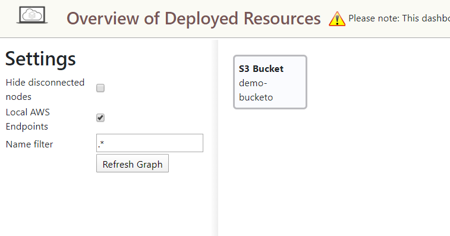

# secure-file-storage

[](https://codeclimate.com/github/SierraSystems/secure-file-storage/maintainability) [](https://codeclimate.com/github/SierraSystems/secure-file-storage/test_coverage)

## Running Locally

```bash
docker-compose up
```

containers:
| name | description | url |
| --- | --- | --- |
| localstack/s3 | localstack S3 service | [http://localhost:4566](http://localhost:4566) |
| secure-file-storage-api | s3 api gateway | [http://localhost:8056/store](http://localhost:8056/store) |

## Initial Setup

Install the [AWS CLI](https://aws.amazon.com/cli/).

run

```bash
aws configure

AWS Access Key ID [None]: 123
AWS Secret Access Key [None]: xyz
Default region name [None]: 
Default output format [None]: 

```

Create a bucket using the gateway

```bash
aws --endpoint-url=http://localhost:8056/store s3 mb s3://demo-bucket
```

Attach an [ACL](https://docs.aws.amazon.com/AmazonS3/latest/dev/acl-overview.html) to the bucket so it is readable:

```bash
aws --endpoint-url=http://localhost:8056/store s3api put-bucket-acl --bucket demo-bucket --acl public-read
```

go to [http://localhost:8055](http://localhost:8055) to check that the bucket has been created



Upload a new file using [postman collection](tests/secure-file-storage.postman_collection.json)

Select `Upload a file` request, go to body and click `Select File`

once you have uploaded your file (you should get a 200)

Select `Get image` request and execute.

You should see your image in postman

Source:

- [How to fake AWS locally with LocalStack](https://dev.to/goodidea/how-to-fake-aws-locally-with-localstack-27me)
- [Testing file uploads to AWS S3 with IAM user credentials in Postman](https://medium.com/@christinavhastenrath/testing-file-uploads-to-aws-s3-with-iam-user-credentials-in-postman-5026fbde3ca6)
